# 糖尿病管理助手（Diabetes Management Assistant）

> 一款面向糖尿病患者的一站式健康管理 Web 应用，采用移动端优先的响应式设计，模拟原生 App 的交互体验。项目以「预治智能」为核心，覆盖健康信息展示、个性化方案定制、打卡记录、健康资讯、AI 智能问答、医师在线咨询与风险评估等完整闭环。

<p align="center">
  
</p>

---

## ✨ 功能特性

| 模块 | 说明 |
| --- | --- |
| 🔐 用户中心 | 注册 / 登录、记住密码、个人信息查看与修改、通知设置 |
| 🏠 首页 | 轮播图、医生横向卡片、健康科普文章、糖尿病类型知识 |
| 📋 方案定制 | 个性化生活方案定制、打卡、打卡记录查看、AI 打卡分析 |
| 📰 健康资讯 | 个性化标签推荐、资讯详情、收藏与收藏管理 |
| 🤖 AI 助手 | AI 控糖助手多轮对话、AI 智能管理平台 |
| 🩺 医师咨询 | 医师在线流式聊天、历史记录持久化、多医生会话 |
| 🩸 风险评估 | 糖尿病风险信息采集、风险结果展示 |
| 🔔 通知系统 | 打卡提醒、设置面板、Web 通知 |

> 共 **23 项**已实现功能，覆盖从「信息获取 → 风险评估 → 方案定制 → 日常打卡 → 健康管理」的完整用户旅程。

---

## 🖼 界面预览

| 登录 | 注册 |
| --- | --- |
| 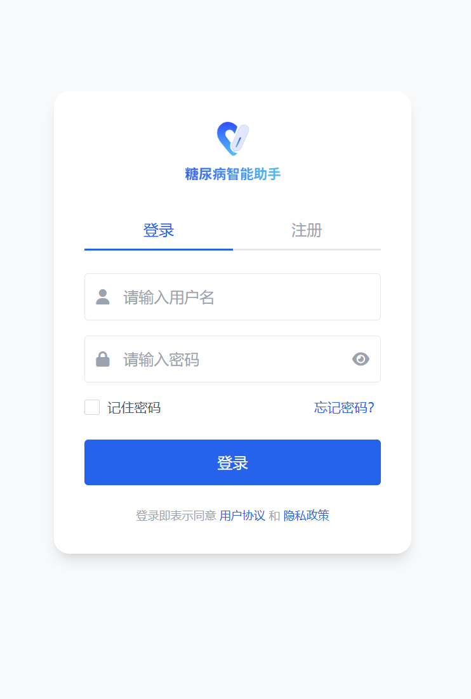 | 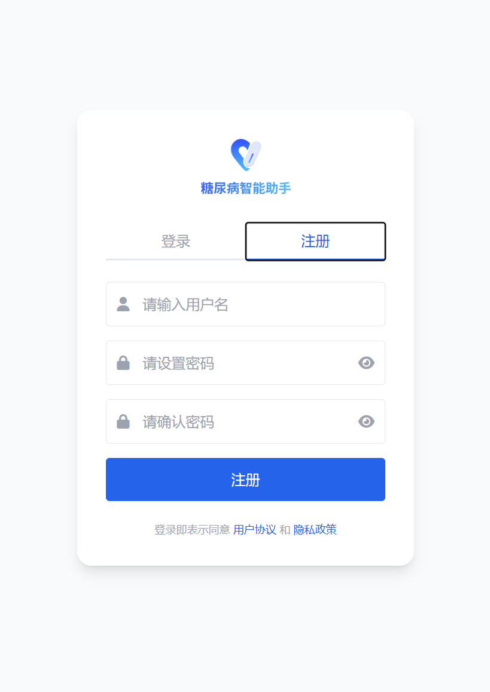 |

| 首页 | 糖尿病类型 |
| --- | --- |
|  | 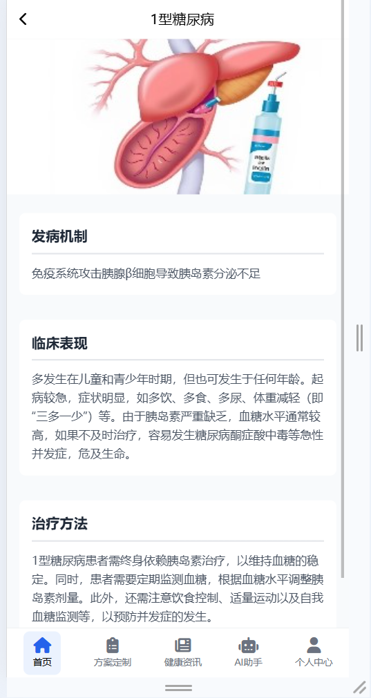 |

| 方案定制 | 生活方案 |
| --- | --- |
| 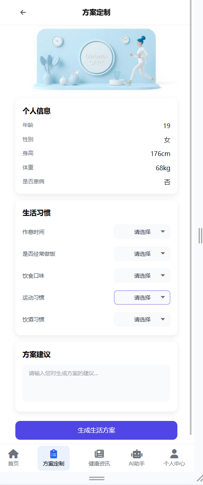 |  |

| 打卡记录 | 打卡分析 |
| --- | --- |
| 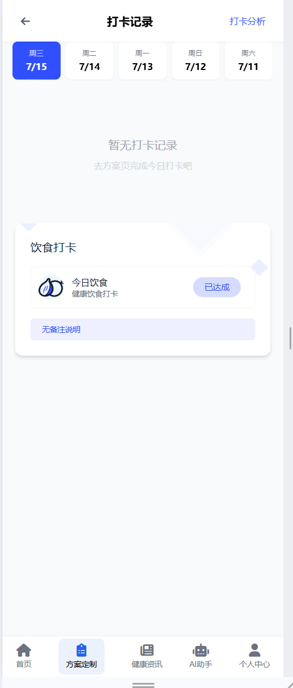 | 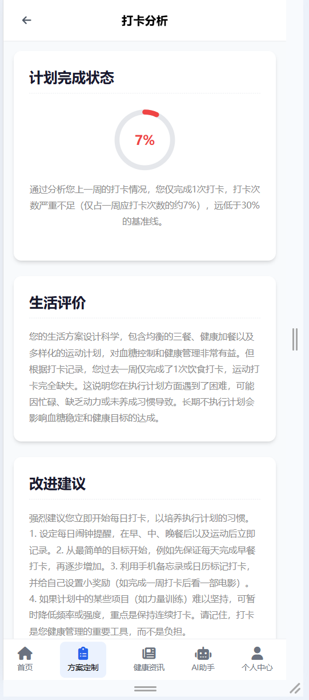 |

| 健康资讯 | 资讯详情 |
| --- | --- |
| 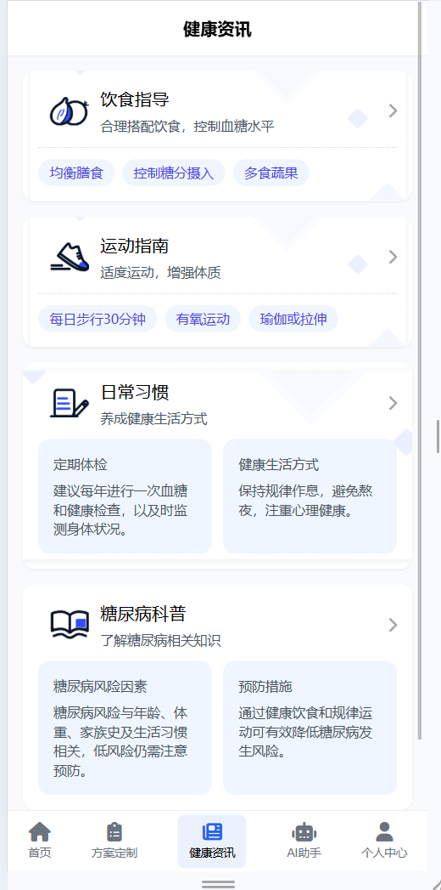 | 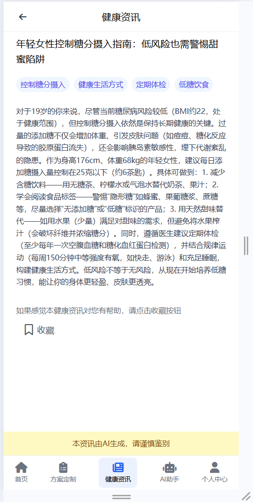 |

| AI 助手 | AI 聊天 |
| --- | --- |
| 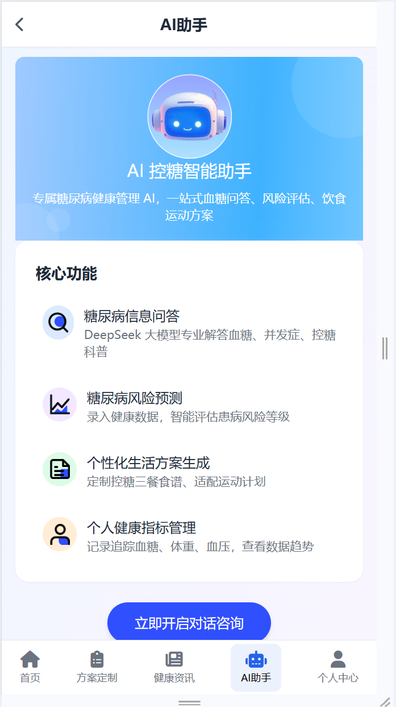 |  |

| 医师咨询 | 个人中心 |
| --- | --- |
| 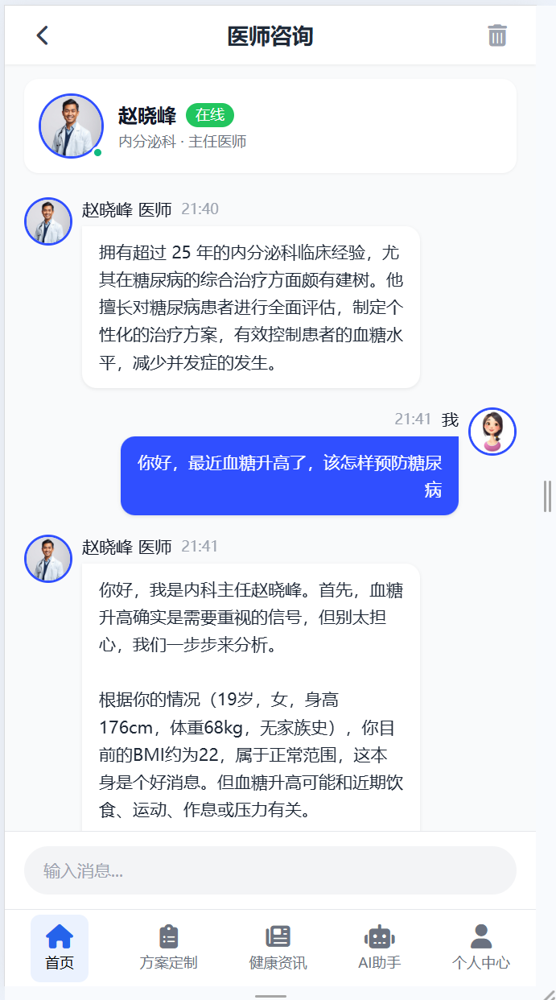 | 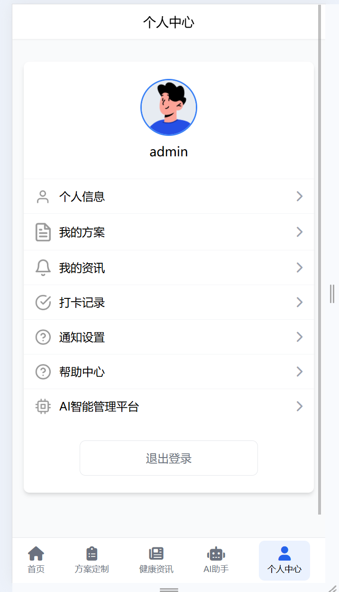 |

<details>
<summary>📷 查看全部截图</summary>

- [糖尿病科普详情（首页）](screenshots/糖尿病科普详情（首页）.png)
- [首页-2](screenshots/首页-2.png)
- [AI 助手聊天-2](screenshots/ai助手聊天页面-2.png)
- [医师咨询-2](screenshots/医师咨询-2.png)
- [智能管理平台-1](screenshots/智能管理页面-1.png)
- [智能管理平台-2](screenshots/智能管理页面-2.png)
- [智能管理平台-3](screenshots/智能管理页面-3.png)
- [我的方案](screenshots/我的方案页面.png)
- [我的咨询](screenshots/我的咨询页面.png)
- [个人信息](screenshots/个人信息界面.png)
- [修改个人信息-1](screenshots/修改个人信息页面-1.png)
- [修改个人信息-2](screenshots/修改个人信息页面-2.png)

</details>

---

## 🎬 演示视频

| 功能 | 视频 |
| --- | --- |
| 登录 | [登录.mp4](videos/登录.mp4) |
| 注册 | [注册.mp4](videos/注册.mp4) |
| 首页功能实现 | [首页功能实现.mp4](videos/首页功能实现.mp4) |
| 方案定制 / 打卡 | [打卡记录与分析.mp4](videos/打卡记录与分析.mp4) |
| 健康资讯 | [健康资讯生成与收藏.mp4](videos/健康资讯生成与收藏.mp4) |
| AI 智能助手 | [AI智能助手.mp4](videos/AI智能助手.mp4) |
| AI 智能管理平台 | [AI智能管理平台.mp4](videos/AI智能管理平台.mp4) |
| 医师咨询 | [医师咨询.mp4](videos/医师咨询.mp4) |
| 个人中心 | [个人中心功能实现.mp4](videos/个人中心功能实现.mp4) |

> 点击视频文件名即可在 GitHub 页面内预览播放。

---

## 🛠 技术栈

| 层面 | 技术 |
| --- | --- |
| 前端 | 原生 HTML / CSS / JavaScript（ES6+） |
| 样式 | [Tailwind CSS](https://tailwindcss.com/)（CDN 运行时） |
| UI 组件 | [Swiper.js](https://swiperjs.com/)（轮播）、[SweetAlert2](https://sweetalert2.github.io/)（弹窗）、[Font Awesome](https://fontawesome.com/)（图标） |
| 后端 AI | [Dify](https://dify.ai/) 平台（多工作流 API） |
| 数据交互 | Fetch API + SSE 流式传输 |
| 存储 | localStorage / sessionStorage（带过期缓存策略） |

---

## 📁 项目结构

```
diabetesAssistant/
├── index.html                  # 应用外壳（iframe 容器 + 底部 5 Tab 导航）
├── login.html                  # 登录 / 注册页
├── js/
│   ├── api.js                  # Dify 接口封装层（工作流 + 聊天流）
│   ├── config.example.js       # 配置模板（复制为 config.js 使用）
│   ├── user.js                 # 用户信息与风险信息缓存
│   ├── notification.js         # 通知系统
│   ├── showAlert.js            # 全局提示组件
│   └── ...                     # 其它工具库（tailwind/swiper/sweetalert2）
├── css/                        # 全局样式与字体图标
├── img/                        # 静态图片资源
├── main/                       # 首页模块（首页 / 文章 / 糖尿病知识）
├── scheme/                     # 方案定制模块（定制 / 生成 / 无方案）
├── checkcard/                  # 打卡模块（打卡列表 / AI 打卡分析）
├── lifeadvice/                 # 健康资讯模块（主页 / 详情 / 收藏）
├── ai/                         # AI 助手模块（入口 / 用户端 / 管理端）
├── chat/                       # 医师咨询模块
├── informationGathering/       # 风险信息采集
├── riskOutcome/                # 风险评估结果
├── mine/                       # 个人中心
├── userinfo/                   # 个人信息管理
├── videos/                     # 功能演示视频
├── screenshots/                # 界面截图
└── knowledge-base/             # 项目知识库（知识文档 / Dify 工作流 / 数据库）
```

---

## 🚀 快速开始

### 环境要求

- 任意静态 Web 服务器（本项目使用绝对路径 `/js/...`，需从**项目根目录**启动服务）
- 可访问的 Dify 服务地址与对应应用的 API Key

### 启动步骤

1. **克隆仓库**

   ```bash
   git clone https://github.com/Au1314/-Deepseek-.git
   cd -Deepseek-
   ```

2. **配置后端连接**

   ```bash
   cp js/config.example.js js/config.js
   ```

   编辑 `js/config.js`，填入你自己的 Dify 服务地址与各工作流的 API Token（该文件已被 `.gitignore` 忽略，不会提交到仓库）。

3. **启动本地静态服务**

   ```bash
   # 方式一：Python
   python -m http.server 8000

   # 方式二：Node.js
   npx serve .
   ```

4. **访问应用**

   打开浏览器访问 `http://localhost:8000/login.html`，注册或登录后即可体验完整功能。

> ⚠️ 未配置 `config.js` 时页面 UI 可正常渲染，但无法连接后端，数据接口将返回占位符错误。

---

## ⚙️ 配置说明

本项目通过 `js/config.js` 注入运行时配置，`api.js` 会优先读取 `window.APP_CONFIG`，未配置时回退到占位符：

```js
window.APP_CONFIG = {
    BASE_API: "http://YOUR_DIFY_HOST",   // Dify 服务地址（不含 /v1/ 路径）
    SQL_AUTH_TOKEN: "Bearer app-...",    // SQL/Text2SQL 工作流 Token
    DM_AUTH_TOKEN: "Bearer app-...",     // 数据管理工作流 Token
    DD_AUTH_TOKEN: "Bearer app-...",     // 糖尿病检测工作流 Token
    LP_AUTH_TOKEN: "Bearer app-...",     // 生活方案定制工作流 Token
    LA_AUTH_TOKEN: "Bearer app-...",     // 生活建议工作流 Token
    AL_AUTH_TOKEN: "Bearer app-...",     // 打卡分析工作流 Token
    AI_CHAT_TOKEN: "Bearer app-...",     // AI 助手聊天流 Token
    ADMIN_AUTH_TOKEN: "Bearer app-...",  // AI 管理平台 Token
    DOCTOR_CHAT_TOKENS: {                // 医师咨询聊天 Token（按医生映射）
        "1": "Bearer app-...",
        "2": "Bearer app-...",
        "3": "Bearer app-..."
    }
};
```

---

## 🏗 架构设计

### 整体架构

应用采用 **iframe 嵌套的单页应用（SPA）** 架构：`index.html` 作为外壳承载底部 5 个 Tab 导航，各功能模块作为独立子页面被加载到 iframe 中，通过 `localStorage` 实现跨页面状态共享。

```
┌─────────────────────────────────────────────┐
│                index.html (外壳)              │
│  ┌─────────────────────────────────────────┐ │
│  │          iframe（功能子页面）             │ │
│  │  首页 / 方案 / 资讯 / AI / 个人中心        │ │
│  └─────────────────────────────────────────┘ │
│  ┌─────┬─────┬─────┬─────┬─────┐            │
│  │首页 │方案 │资讯 │AI  │我的 │  ← 底部 Tab   │
│  └─────┴─────┴─────┴─────┴─────┘            │
└─────────────────────────────────────────────┘
```

### 数据流

```
前端页面 → api.js 封装层 → Dify 工作流/聊天流 → 后端(Express + SQLite/Text2SQL) → 返回解析
                │
                └── 统一响应解析 + 数据类型清洗 + XSS 转义
```

### 关键实现

- **统一解析层**：兼容 Dify 多种响应格式（`data.outputs.body`、`data.result`、直接返回等），多层条件判断依次提取数据。
- **流式处理**：基于 `ReadableStream` + `TextDecoder` 逐块解析 SSE，拼接回复文本并提取 `conversation_id` 维持会话上下文。
- **数据清洗**：自动将字符串数字字段转为 `number`，必填字段空值兜底，规避 Dify 输入类型校验报错。
- **缓存策略**：`sessionStorage` 带 1 小时过期时间，减少重复 API 请求。
- **安全防护**：`escapeHtml` 对动态渲染内容做 HTML 实体转义，防 XSS。

---

## 🔌 后端对接（Dify 工作流）

| 工作流 | 封装函数 | 说明 |
| --- | --- | --- |
| Text2SQL | `fetchSQLWorkflow` | 自然语言转 SQL 查询，间接操作 SQLite |
| 数据管理 | `runWorkflow` | 通用数据管理工作流 |
| 糖尿病检测 | `fetchDiabetesDetectionWorkflow` | 风险评估 |
| 生活方案 | `fetchLifePlansWorkflow` | 个性化方案定制 |
| 生活建议 | `fetchLifeAdviceWorkflow` | 健康资讯标签/详情生成 |
| 打卡分析 | `fetchAnalysisWorkflow` | AI 打卡数据分析 |
| 聊天流 | `fetchChatflow` / `fetchDoctorChat` / `fetchAIChatflow` | 流式对话（AI 助手 / 医师咨询） |

---

## 📚 知识库

`knowledge-base/` 目录存放项目运行所依赖的配套资料：

- **知识文档**：1 型 / 2 型 / 妊娠型 / 特殊型糖尿病生活注意事项全攻略等 `.docx` 文档，作为 AI 助手（Dify 知识库）的参考素材
- **Dify 工作流**：`健康资讯.yml`、`打卡分析.yml` 等工作流 DSL 导出文件
- **数据库**：`sqlite.db`（SQLite 数据文件）、`db.txt`（建表结构）、`数据表字典文档.html`（字段说明）
- **部署手册**：`dify本地服务端操作手册.docx`

---

## 🔒 安全说明

- 所有 API Token 已从代码中剥离，通过被 `.gitignore` 忽略的 `js/config.js` 注入，**请勿将真实 Token 提交到仓库**。
- 动态渲染内容统一经过 `escapeHtml` 转义，避免 XSS 攻击。
- 本项目为实习/学习演示项目，生产环境建议进一步引入密码哈希存储、HTTPS 与后端鉴权。

---

## 📄 License

本项目用于学习与展示目的，代码与资源仅限个人学习交流使用。

---

*README 生成时间：2026-09-19*
